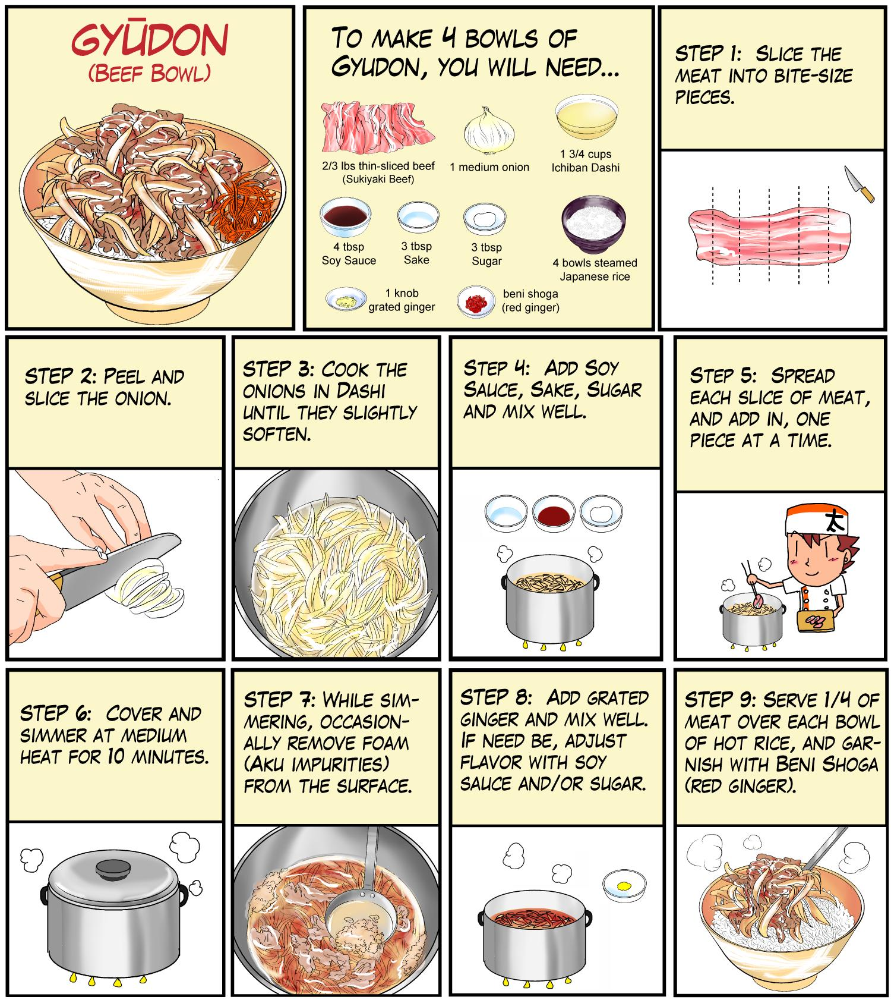

# Recipe finder #

Final project for the Building AI course

## Summary

A web app that would tell you what dishes you could make with the available ingredients that you have. As well as step by step recipe. 

## Background

When deciding what to cook everyday I often get tired of eating the same thing or going to the store to buy ingredients that are missing for the dish I want to make. I can often figure out what easy to make dishes I want to make when I am tired but they never end up being so fulfilling since I just used available ingredients and just wanted to create something from what was available. Instead of doing something from my knowledge that I have already done so many times, I would like to try something new. 

## How is it used?

The web app would have a information box where you would fill in all types of available ingredients that you have at home. You would also fill in details for how many you are cooking for, the amount of the ingredients that you have, what type of meal (breakfast, lunch, dinner). Some more information could be needed, perhaps what cooking tools or appliances that you have available. After filling out all necessary information needed. The app would then introduce many different dishes from all over the world along with recipes on how you would make the dish. Reviews could also be implemented to help and recommend others on what other people think of the dish. The app could also have recipes and dishes that you could upload yourself. 

## Data sources and AI methods
The data sources that would be used in this web app would come from various websites or blogs that post recipes for the public. One example would be the [Arla API.](https://www.arla.se/recept/) That website and many other cooking websites could be used to present different recipes from different parts of the world.

## Challenges

One challenge my project would have is that only dishes that have been published for the public would be available. Dishes that can not be found on the web is what will not be available. That would require user interaction on the website and people would have to manually upload them and that requires a lot of users on the website that are active and produces recipes.

## What next?

The project could grow by creating and app and maybe perhaps the tool of using an AI as a sort of companion during the cooking session that you could write to or speak to, that would help you and respond back to you which would help you with the creation of the dish. That would also make the app more personal and more helpful for a lot of users who stumbles upon difficulties with the recipes. 

## Acknowledgments

* Inspiration from [Arla API.](https://www.arla.se/recept/) that allows you to search for a specific ingedient and shows you recipes with that specific ingredient. 
* Picture taken from: [Recipe picture](https://cooking.stackexchange.com/questions/47670/what-cut-of-beef-can-i-use-to-make-sukiyaki-beef)
